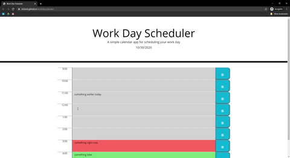

# [Hourly Day Planner](https://mrtavit.github.io/workday.planner/)

## Welcome to my Hourly Planner!

The functionality of this planner is primarily built using jQuery and it utilizes [Luxon.js](https://moment.github.io/luxon/index.html) in order to calculate the current time.

The current date will be displayed at the top of the webpage, and the user will be presented a series of rows based on a standard 9am-5pm business day.

By clicking or tabbing down to the field next to the time, a text box will be available. After entering some text, clicking the save button on the right side of the bar will save the text locally. (Tabbing over and pressing enter also works).

When the page is refreshed the text that the user saved will reappear within the corresponding box.

 